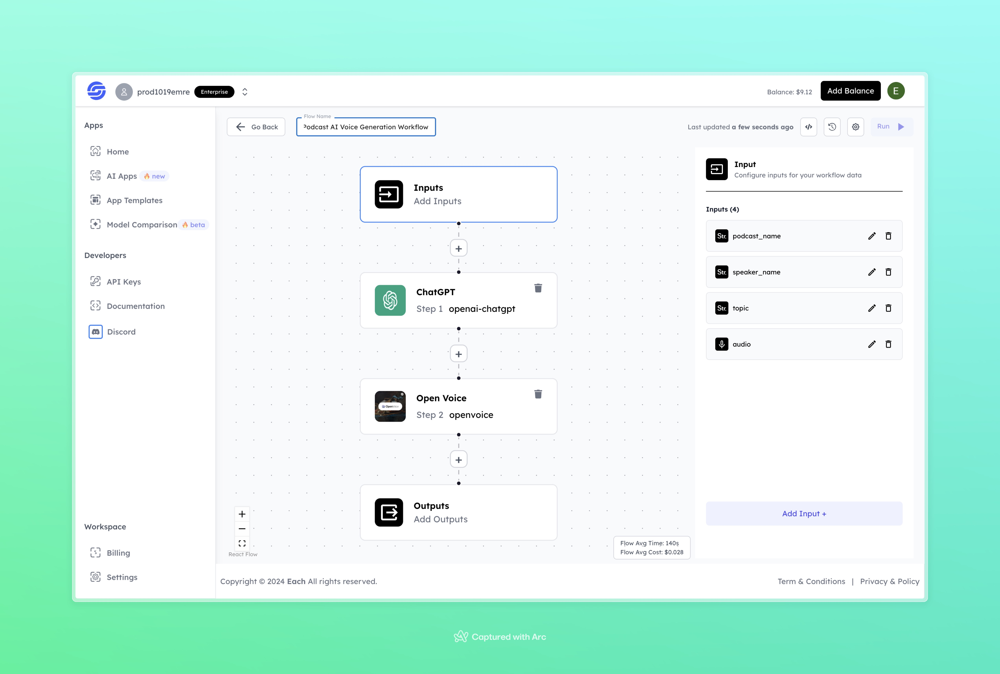

# Podcast AI Voice Generation Workflow

## Overview
Generate Podcast AI Voices using Eachlabs workflows—easily integrate custom AI-generated voices for podcasts into your web and mobile applications with Eachlabs API.

## Features
- **Custom Inputs** for podcast name, speaker name, and topic  
- **AI Text Generation** using ChatGPT for content creation  
- **Voice Synthesis** with Open Voice to generate realistic audio  

## Inputs

### 1. `podcast_name`
- **Type:** String  
- **Title:** Podcast Name  
- **Component:** Input field  

**Description:** Provide the name of the podcast that will be generated.  

### 2. `speaker_name`
- **Type:** String  
- **Title:** Speaker Name  
- **Component:** Input field  

**Description:** Enter the name of the podcast speaker or host.  

### 3. `topic`
- **Type:** String  
- **Title:** Topic  
- **Component:** Input field  

**Description:** Specify the topic or theme for the podcast episode.  

### 4. `audio`
- **Type:** File  
- **Title:** Audio  
- **Component:** File Upload  

**Description:** Upload any reference audio to guide the voice synthesis process.  

## Example Input and Output

### Input
- **Podcast Name:** Business Daily  
- **Speaker Name:** Emily 
- **Topic:** How recycling can be profitable?  
- **Audio:** [Podcast Audio Input](https://cdn.eachlabs.ai/ipfs/3FA9ck5a0woAEJulGzeg3CJkcPVBcLCfdixBNrAxA8ediDrlA/out.wav)

### Output

- **Generated Audio:**  
[Podcast Audio Output](https://storage.googleapis.com/magicpoint/github-outputs/podcast-ai-voice-generaiton-workflow-output.wav)

## Conclusion

If you encounter an error, you can join our <b><a href="https://discord.com/invite/yzZD4ZxBPt" target="_blank">Discord</a></b> server.
