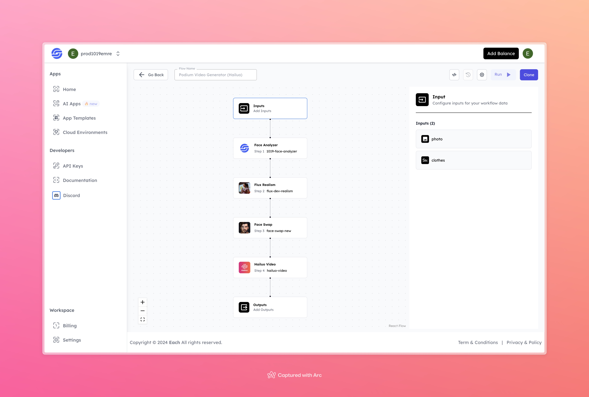

# Podium Video Generator with Hailuo

## Overview
The Podium Video Generator with Hailuo helps users make personalized videos by taking a photo and adding a chosen clothing style. It uses face analysis, realism effects, face swapping, and video generation to turn your input into a custom video.

## Features
- **Face Analysis** with 1019-Face-Analyzer
- **Realism Enhancement** using Flux Dev Realism
- **Face Swapping** using Face-Swap-New
- **Video Generation** with Hailuo Video

## Use Cases
- Personalized video creation with specific clothing styles
- Social media content creation with unique and realistic effects
- Quick and easy generation of custom videos based on individual photos

## Inputs

### 1. photo
- **Type:** File 
- **Title:** Photo
- **Component:** Image Upload

**Description:** Upload a photo to be used as the base image in the video generation process.

### 2. clothes
- **Type:** String
- **Title:** Clothes
- **Component:** Input field

**Description:** Specify the type or style of clothing to be applied in the generated video.

## Example 

### Input
- **Photo:** 

- **Clothes:** transparent dress

### Output
- **Video:** 
[Output Video](https://storage.googleapis.com/magicpoint/github-outputs/podium-video-generator-with-hailuo-github-output.mp4)

## Conclusion

If you encounter an error, you can join our <b><a href="https://discord.com/invite/yzZD4ZxBPt" target="_blank">Discord</a></b> server.
