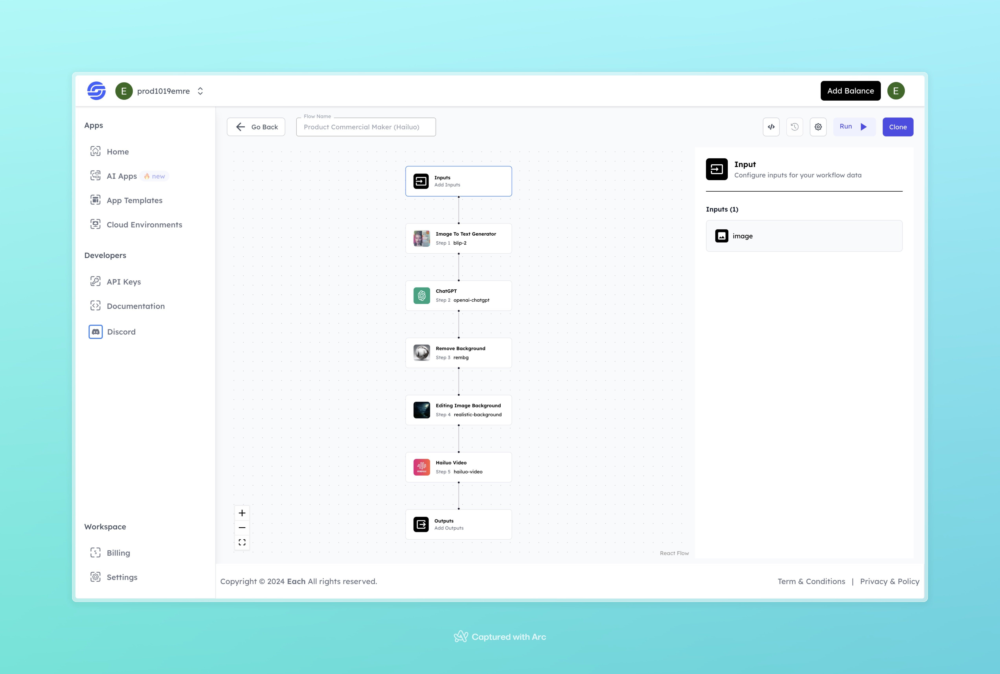

# Product Commercial Maker (Hailuo)

## Overview
The Product Commercial Maker helps you create high-quality product commercials from a simple image. With a few automated steps, it can remove backgrounds, enhance images, and generate a commercial-ready video. Just upload an image and let the flow do the rest!

## Features
- **Image to Text Generation**: Extracts descriptive text from an uploaded image.
- **Background Removal and Replacement**: Removes the original background and adds a custom one.
- **Commercial Video Creation**: Converts the edited image into a commercial video.

## Use Cases
- Quickly create product commercials for social media and e-commerce listings.
- Transform product images into engaging videos with minimal effort.
- Use it for advertising campaigns where visual content needs to be sharp and appealing.

## Example

### Input
- **Image:**

### Output
- **Product Commercial Video**:
[Output Video](https://storage.googleapis.com/magicpoint/github-outputs/product-commercial-maker-hailuo-github-output.mp4)

## Conclusion

If you need further assistance or have any questions, join our <b><a href="https://discord.com/invite/yzZD4ZxBPt" target="_blank">Discord</a></b> community.
