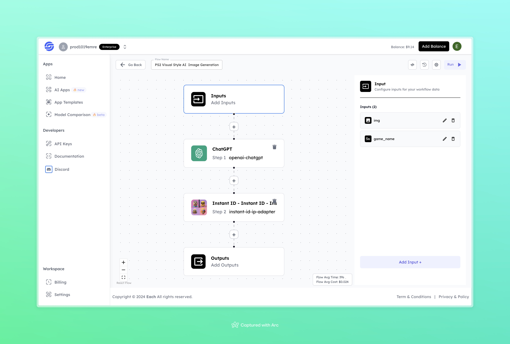

# PS2 Visual Style AI Image Generation Workflow

## Overview

Generate PS2 Visual Style AI Images using Eachlabs workflows—easily integrate retro gaming-inspired visuals into your web and mobile applications with Eachlabs API.

---

## Features

- **ChatGPT Integration**: Generates detailed and game-specific prompts.  
- **Instant ID Adapter**: Processes the input image to align with the desired visual style.  
- **Custom Outputs**: Produces tailored outputs based on the input image and game name.  

---

## Inputs

### 1. `img`  
- **Type:** File  
- **Title:** Input Image  
- **Component:** Image Upload  

**Description:** Upload the image that you want to transform into a PS2-style visual.

### 2. `game_name`  
- **Type:** String  
- **Title:** Game Name  
- **Component:** Text Input  

**Description:** Specify the name of the game to influence the visual theme and style.

---

## Example Input and Output

### Input  
- **Image:**  
  

- **Game Name:** Half Life 2

---

### Output  
  

---

## Conclusion

If you encounter an error, you can join our <b><a href="https://discord.com/invite/yzZD4ZxBPt" target="_blank">Discord</a></b> server.