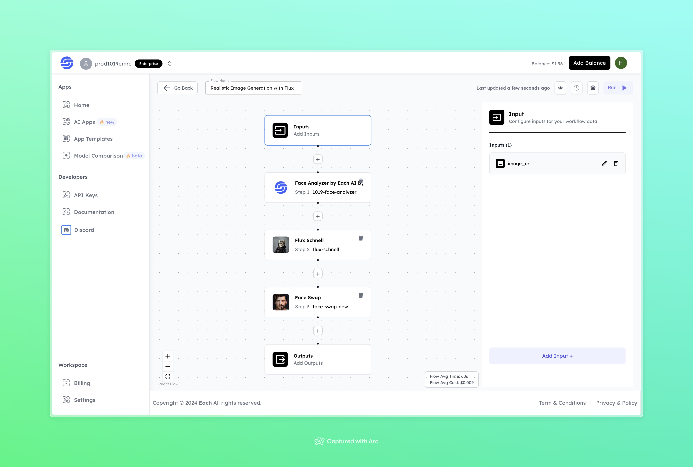

# Realistic Image Generation with Flux

## Overview

Create Realistic Images with Flux using Eachlabs workflows—easily integrate lifelike image generation into your web and mobile applications with Eachlabs API.

---

## Features

- **Face Analyzer by Each AI**: Analyzes and detects face details for accurate transformation.  
- **Flux Schnell**: Applies realistic and high-speed transformations to input images.  
- **Face Swap**: Generates enhanced and swapped faces while preserving realism and quality.  

---

## Inputs

### 1. `image_url`  
- **Type:** String (URL)  
- **Title:** Input Image URL  
- **Component:** URL Input  

**Description:** Provide the image URL of the individual you want to process for realistic face generation.  

---

## Example Input and Output

### Input  

  

---

### Output  

  

---

## Conclusion

If you encounter an error, you can join our <b><a href="https://discord.com/invite/yzZD4ZxBPt" target="_blank">Discord</a></b> server.
