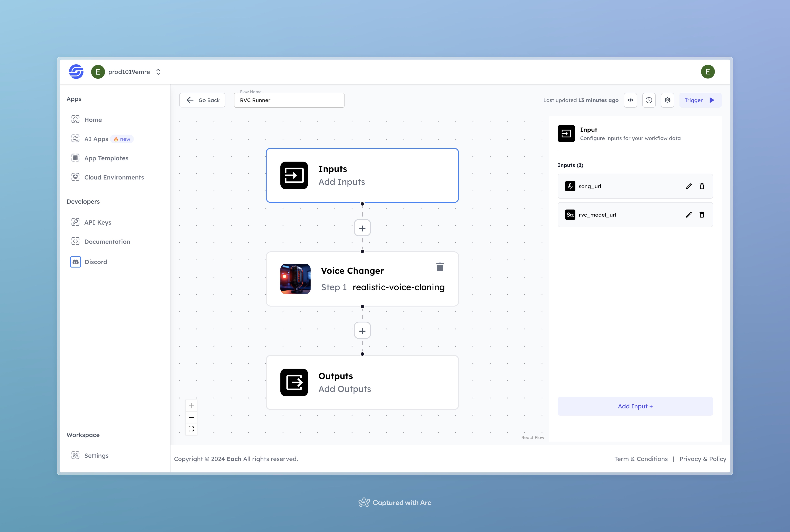

# RVC Runner

## Overview
The **RVC Runner** workflow is designed to take a song file and a model URL for voice conversion. It uses a realistic voice cloning AI model to change the voice in the song based on the provided model. This is a simple tool that quickly processes voice modifications, allowing users to convert audio into different voice styles.

## Features
- **Voice Conversion** based on the provided model
- **Simple Input Structure** for ease of use
- **Quick Processing**

## Inputs

### 1. `song_url`
- **Type:** URL (string)
- **Title:** Song File URL
- **Component:** Input field

**Description:** The URL of the song or audio file that will be processed for voice conversion. Supported formats include `.mp3`, `.wav`, and other common audio types.

### 2. `rvc_model_url`
- **Type:** URL (string)
- **Title:** RVC Model Zip URL
- **Component:** Input field

**Description:** The URL of the zip file containing the voice model that will be used for the conversion. The zip file should include the necessary model files that define the new voice to replace the original one in the song. 

## Usage

Upload a song by providing its URL and specify the URL of the voice model you want to use for conversion. The AI will process the inputs and output the song with the modified voice.

## Examples

### Song Url
[Watch the Song url](https://storage.googleapis.com/magicpoint/global_inputs/Eminem%20-%20Lose%20Yourself.mp3)

### RVC Model Url
[Watch the Rvc Model Url](https://storage.googleapis.com/magicpoint/global_inputs/optimusprime_e300_s41400.zip)

### Output
[Watch the Output Voice](https://storage.googleapis.com/magicpoint/github-outputs/rvc-runner-github-output.mp3)

## Conclusion

If you run into any issues, feel free to join our <b><a href="https://discord.com/invite/yzZD4ZxBPt" target="_blank">Discord</a></b> server for help.
