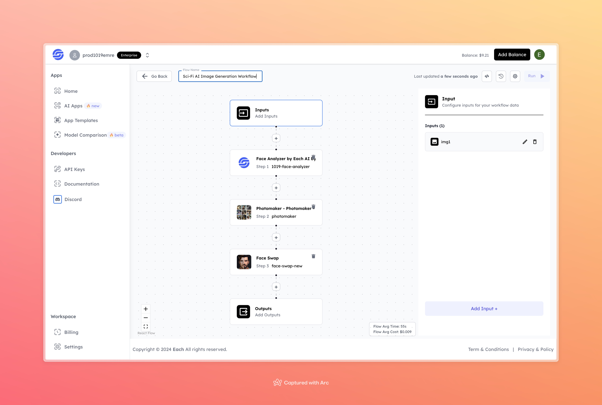

# Sci-Fi AI Image Generation Workflow

## Overview

Create Sci-Fi AI Images using Eachlabs workflows—easily integrate futuristic and sci-fi inspired visuals into your web and mobile applications with Eachlabs API.

---

## Features

- **Face Analyzer by Each AI**: Analyzes and processes facial features for realistic sci-fi transformation.  
- **Photomaker**: Generates and enhances sci-fi-styled images.  
- **Face Swap**: Integrates the analyzed face into the stylized output seamlessly.  

---

## Inputs

### 1. `img1`  
- **Type:** File  
- **Title:** Input Image  
- **Component:** Image Upload  

**Description:** Upload the image of the individual for sci-fi AI transformation.

---

## Outputs

- **Type:** Image  
- **Description:** A sci-fi-inspired AI-generated image.  

---

## Example Input and Output

### Input  
  

---

### Output  
  

---

## Conclusion

If you encounter an error, you can join our <b><a href="https://discord.com/invite/yzZD4ZxBPt" target="_blank">Discord</a></b> server.
