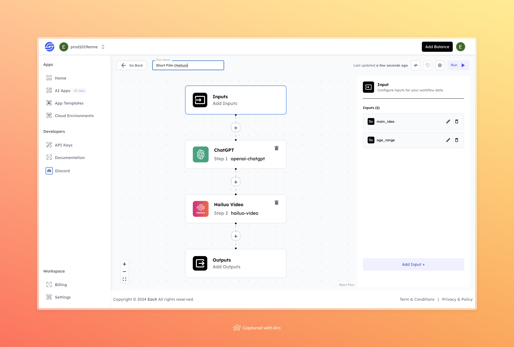

# Short Film Generator using Hailuo AI

## Overview
The Short Film Generator using Hailuo AI helps you create short films by taking a simple idea and an age range as input. It uses AI tools like ChatGPT to write a story based on your idea, and then Hailuo AI turns that story into an animated video. It’s a fast and easy way to bring your concept to life.

## Features
- **AI-Powered Story Creation**
- **Hailuo Video Generation**
- **Simple Input Fields for Main Idea and Target Age**
  
## Use Cases
- Creating animated short films for various age groups
- Educational or entertainment content creation
- Storyboarding ideas for professional or personal projects

## Inputs

### 1. `main_idea`
- **Type:** String
- **Title:** Main Idea
- **Component:** Input field

**Description:** This field takes the core concept for your short film. The model will use this idea as the basis for the generated story and film.

### 2. `age_range`
- **Type:** String
- **Title:** Target Age Range
- **Component:** Input field

**Description:** Specify the target age range for the film, which helps tailor the generated content to an appropriate level for the intended audience.

## Usage

To generate a short film, simply provide a main idea and the target age range in the input fields. The system will use ChatGPT to generate a story and Hailuo AI to transform that story into a short film. The clearer and more specific your input, the better the resulting video.

## Examples

### Input

- **Main Idea:**
A young girl builds her own robot to compete in a tech competition.

- **Age Range:** 6-10

### Output

[Output Video](https://storage.googleapis.com/magicpoint/github-outputs/short-film-hailuo-github-output.mp4)
## Conclusion

If you encounter any issues or need assistance, please join our [Discord](https://discord.com/invite/yzZD4ZxBPt) server for support.
