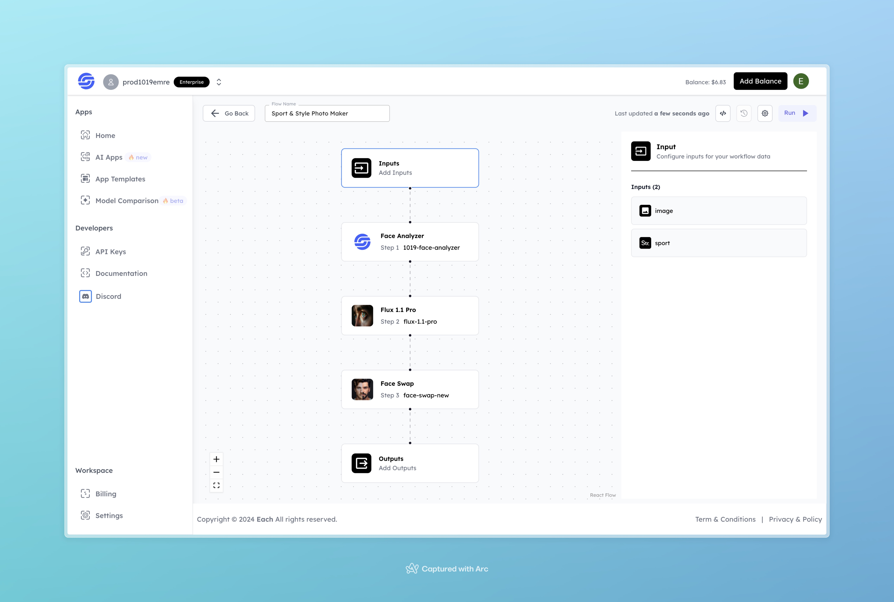

# Sport & Style Photo Maker

## Overview
Sport & Style Photo Maker transforms your photo into a stylish, sport-themed image based on the sport type you choose. Simply upload a photo, select a sport, and the system takes care of the rest.

## Features
- **Face Analysis**: Analyzes facial features from your uploaded photo.
- **Flux 1.1 Pro Transformation**: Stylizes the photo to match the selected sport theme.
- **Face Swap**: Enhances the image with sport-specific facial adjustments.

## Use Cases
- Create promotional images for sports brands.
- Enhance your social media content with unique, sport-themed photos.
- Personalize gifts for friends and family with fun sport-style transformations.

## Inputs

### 1. `image`
- **Type:** File 
- **Title:** Image
- **Component:** Image Upload

**Description:** Upload a clear, front-facing photo to be transformed into a stylish sport-themed image.

### 2. `sport`
- **Type:** Text
- **Title:** Sport Type
- **Component:** Dropdown

**Description:** Select the sport theme for your photo transformation (e.g., soccer, basketball, tennis).

## Example 

### Input
- **Image:** 

- **Sport:** Tennis

### Output
- **Styled Photo**:

## Conclusion

If you encounter an error, you can join our <b><a href="https://discord.com/invite/yzZD4ZxBPt" target="_blank">Discord</a></b> server.
