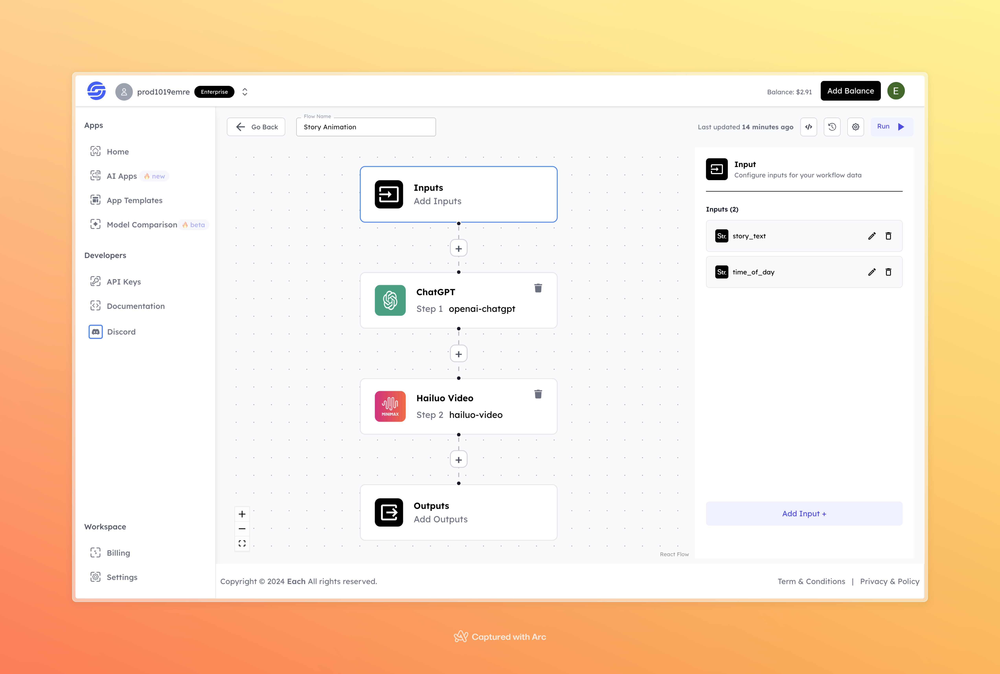

# Story Animation AI Video Generation Workflow

## Overview
Convert written stories into animations with our workflow. You can add scripts, visualize scenes, and integrate voiceovers and sound effects to create immersive animated content for your projects with Eachlabs API.

## Features
- **Text-to-Animation**: Automatically converts written stories into animations.  
- **Time-Based Customization**: Adjusts visuals based on the specified time of day.  
- **High-Quality Outputs**: Generates visually captivating and shareable results.

## Use Cases
- Turn written content into visual media for presentations or personal projects.  
- Create animated stories for social media or marketing campaigns.  
- Enhance storytelling experiences for educational or entertainment purposes.

## Inputs

### 1. `story_text`
- **Type:** String  
- **Title:** Story Text  
- **Component:** Text Input  

**Description:** Provide the main story or text you want to animate.

### 2. `time_of_day`
- **Type:** String  
- **Title:** Time of Day  
- **Component:** Text Input  

**Description:** Specify the time setting (e.g., Morning, Evening) for your animation.

## Example 

### Input
- **Story Text:** You're standing at the edge of a cliff, with an endless ocean stretching out beneath you. The sky is softly lit by the first light of dawn, and the surface of the sea shimmers like gold. Everything is perfectly still. Slowly, you begin to float downwards, but you’re not falling — you’re gently gliding through the air. A light breeze brushes against your face, filling you with a sense of peace and freedom. As you continue to descend, the view around you becomes even more beautiful and captivating.  
- **Time of Day:** Midnight  

### Output
- **Generated Animation:**  

 [Output Video](https://storage.googleapis.com/magicpoint/github-outputs/story-animation-github-output.mp4)

## Conclusion
If you have any questions or encounter issues, feel free to reach out via our <b><a href="https://discord.com/invite/yzZD4ZxBPt" target="_blank">Discord</a></b> community.
