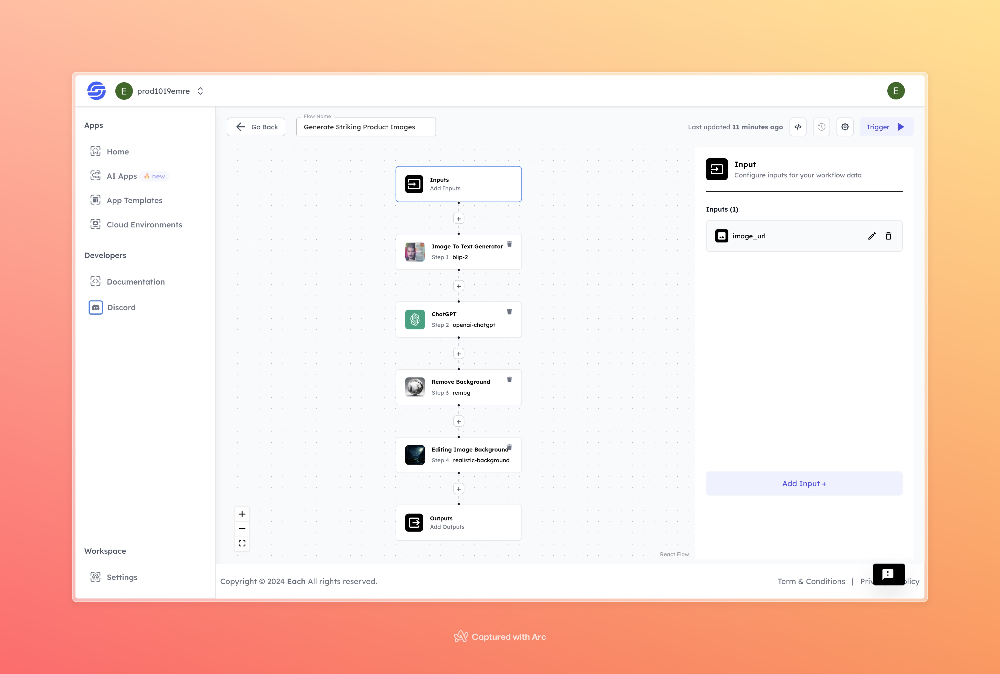

# Generate Striking Product Images

    

## Overview
Need eye-catching product images that pop? With this AI flow, you can turn any ordinary photo into a stunning, professional-looking visual in seconds. Perfect for e-commerce, marketing, or product showcases. Say goodbye to boring backgrounds and hello to sleek, polished images that stand out! Let the AI handle it all—quick, easy, and powerful.

## Features
- **High-Quality Product Image Enhancement**
- **Background Removal and Replacement**
- **Effortless Automation**

## Use Cases
- E-commerce product listings
- Marketing materials
- Product showcase

# AI Flow Execution Inputs

This section explains the required inputs for running the flow successfully.

## Inputs

### 1. `image_url`
- **Type:** Image URL
- **Title:** Product Image
- **Component:** Input field

**Description:** Provide the URL of the product image you want to enhance. Supported formats include `.jpg`, `.png`, etc.

## Usage

These inputs are essential to run the AI model. Accurate and relevant input data will ensure the model operates correctly and generates the best possible product images.

- **Image URL**: Paste the URL of the product image to be processed.

Once the input is provided, the AI flow will:
1. Generate a detailed description of the image.
2. Use AI to remove the background.
3. Apply a realistic background to enhance the overall presentation of the product.

## Examples

### Input 

### Output

  

By using this AI model, you can enjoy a simple and exciting way to transform your product images, making them more striking and professional. It’s a fun and effortless experience, perfect for elevating your brand and showcasing your products at their best.

