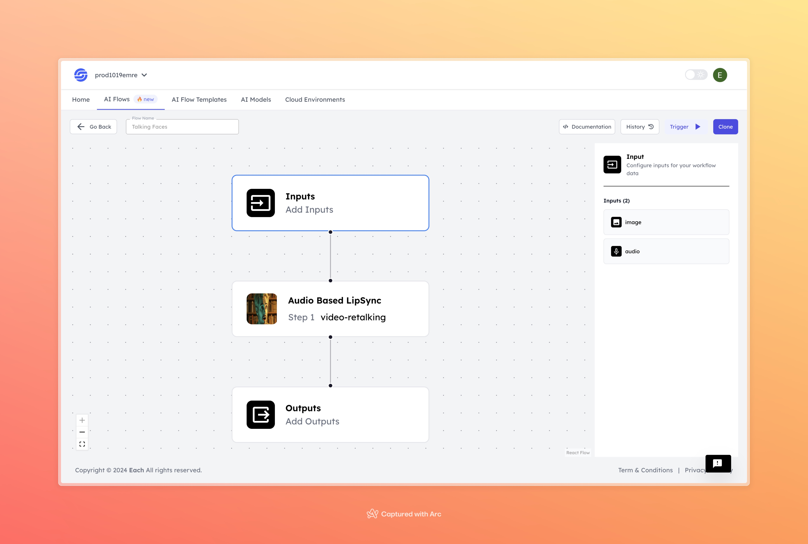

# Video-Retalking AI Flow

  

## Overview
The Video-Retalking AI model uses deep learning to synchronize lip movements in a video with a target audio track. It analyzes both the video and audio to adjust facial movements, ensuring realistic lip-syncing. This tool is useful for dubbing, content creation, and video production, making the process more efficient by automating the synchronization between video and new audio.

## Features
- **High-Quality Lip Sync**
- **Audio-Driven Adjustments**
- **Customizable Outputs**

## Uses Cases
- Film and TV dubbing
- Social media content
- Video conferencing

## Inputs

### 1. `face`
- **Type:** String
- **Title:** Face Image
- **Component:** File

**Description:** This input represents an image file of a face that the model will process. The file should contain the face that the model will analyze and operate on. Supported file formats include `.jpg`, `.png`, etc.

### 2. `input_audio`
- **Type:** String
- **Title:** Input Audio
- **Component:** File

**Description:** This input represents an audio file that the model will process. The audio file should contain the sound that the model will synchronize or analyze. Supported file formats include `.mp3`, `.wav`, etc.

## Usage

These inputs are required parameters for running the model. Providing complete and accurate inputs ensures that the model operates correctly and yields expected results.

- **Face Image**: Upload the face image file.
- **Input Audio**: Upload the audio file.

When these inputs are provided, the model will process the uploaded face image and audio file to perform the specified tasks.
                                                                                                                                                                           
## Examples

### Input 1

### Input 2
[Download or listen to the audio file](https://storage.googleapis.com/magicpoint/github_inputs/github-inputs-video-retalking.wav)

### Output
<video controls width="300">
  <source src="https://storage.googleapis.com/magicpoint/github-outputs/video-retalking-github-output.mp4" type="video/mp4">
  Your browser does not support the video tag.
</video>

[Watch the output video](https://storage.googleapis.com/magicpoint/github-outputs/video-retalking-github-output.mp4)

## Conclusion

If you encounter an error, you can join our <b><a href="https://discord.com/invite/yzZD4ZxBPt" target="_blank">Discord</a></b> server.