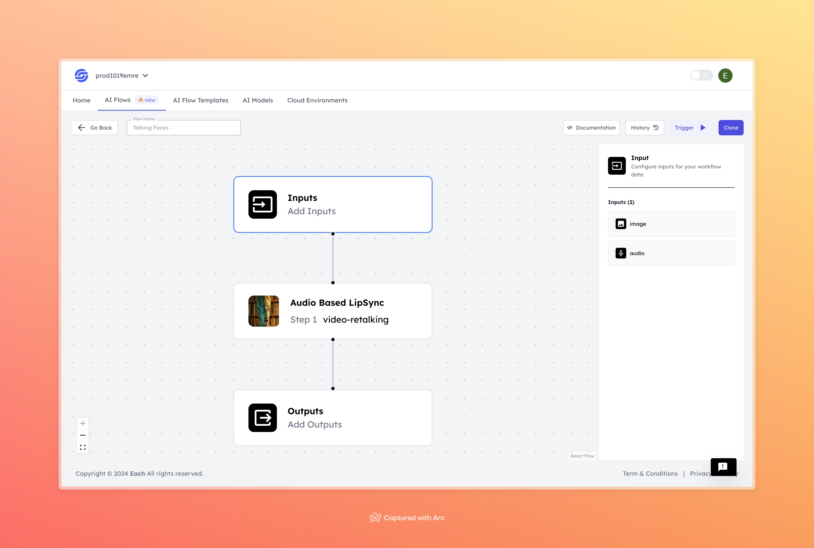

<!-- ABOUT THE PROJECT -->

# Video-Retalking AI Model

    

## Overview
The Video-Retalking AI model is designed to synchronize facial movements in a video with a target audio track. It uses deep learning techniques to provide realistic lip-syncing, perfect for dubbing, content creation, and video production.

## Features
- **High-Quality Lip Sync**
- **Audio-Driven Adjustments**
- **Customizable Outputs**

## Uses Cases
- Film and TV dubbing
- Social media content
- Video conferencing
x

# AI Flow Execution Inputs

This document provides explanations for the execution inputs used in your AI model.

## Inputs

### 1. `face`
- **Type:** String
- **Title:** Face Image
- **Component:** File

**Description:** This input represents an image file of a face that the model will process. The file should contain the face that the model will analyze and operate on. Supported file formats include `.jpg`, `.png`, etc.

### 2. `input_audio`
- **Type:** String
- **Title:** Input Audio
- **Component:** File

**Description:** This input represents an audio file that the model will process. The audio file should contain the sound that the model will synchronize or analyze. Supported file formats include `.mp3`, `.wav`, etc.

### 3. `audio_duration`
- **Type:** Number
- **Title:** Audio Duration
- **Component:** Input

**Description:** This input specifies the duration of the above-mentioned audio file. The model will use this value for operations related to the length of the audio. The duration should be entered as a number in seconds.

## Usage

These inputs are required parameters for running the model. Providing complete and accurate inputs ensures that the model operates correctly and yields expected results.

- **Face Image**: Upload the face image file.
- **Input Audio**: Upload the audio file.
- **Audio Duration**: Enter the duration of the audio file in seconds.

When these inputs are provided, the model will process the uploaded face image and audio file to perform the specified tasks.
                                                                                                                                                                           
## Examples

<!DOCTYPE html>
<html lang="en">
<head>
    <meta charset="UTF-8">
    <meta name="viewport" content="width=device-width, initial-scale=1.0">
    
</head>
<body>
    

        

            
Input

            

            

                <h3> Input 1</h3>
                
            

            

                <h3> Input 2</h3>
                <audio controls>
                    <source src="https://storage.googleapis.com/magicpoint/github_inputs/github-inputs-video-retalking.wav" type="audio/wav">
                    Your browser does not support the audio tag.
                </audio>
            

        

        

            
Output

            

            <h3></h3>
            <video controls volume="1.0">
                <source src="https://storage.googleapis.com/magicpoint/github-outputs/video-retalking-github-output.mp4" type="video/mp4">
                Your browser does not support the video tag.
            </video>
            <a href="https://storage.googleapis.com/magicpoint/github-outputs/video-retalking-github-output.mp4" target="_blank">
                Video Output
            </a>
        

    

</body>
</html>

