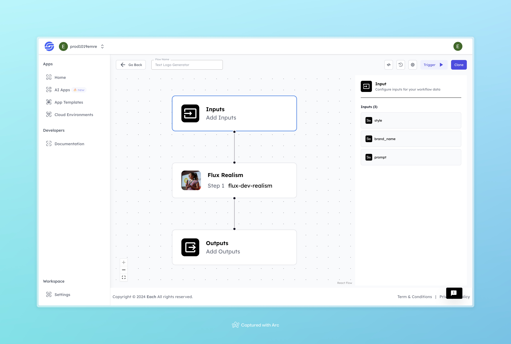

# Text Logo Generator

## Overview
The Text Logo Generator AI simplifies the process of creating custom text-based logos. By taking user input such as font style, color, and layout preferences, the model generates logos that reflect the desired branding. This tool is ideal for designers, marketers, and business owners who need quick and efficient logo creation without manual design work. It provides an easy way to produce clean and professional text logos that suit various branding needs.

## Features
- **Variety of Design Styles**
- **Customizable Brand Name and Text**
- **Simple and Intuitive UI**

## Use Cases
- Business branding
- Marketing and promotional materials
- Website and social media logos

## Inputs

### 1. `style`
- **Type:** String
- **Title:** Logo Style
- **Component:** Input field

**Description:** This input defines the overall style of the logo. Users can select from various styles such as modern, classic, minimalist, and more. The chosen style will be reflected in the generated logo.

### 2. `brand_name`
- **Type:** String
- **Title:** Brand Name
- **Component:** Input field

**Description:** This input specifies the brand name that will be featured in the logo. The AI model will incorporate this brand name into the design to create a personalized logo.

### 3. `prompt`
- **Type:** String
- **Title:** Logo Text
- **Component:** Input field

**Description:** This input represents additional text or a tagline that will appear alongside the brand name in the logo. Users can add any relevant text they want to be included in the logo.

## Usage

These inputs are essential for running the model. Providing complete and accurate inputs will ensure the model functions correctly and provides the desired results.

- **Logo Style:** Specify the desired style for your logo.
- **Brand Name:** Enter the name of your brand.
- **Logo Text:** Add any additional text or tagline.

When these inputs are provided, the model will generate a custom text logo based on the specified style, brand name, and text.

## Examples

### Input
- **style:** Futuristic
- **brand name:** Toys
- **prompt:** Generate a logo for a children's toy store, featuring playful animals and vibrant colors to reflect fun and imagination

### Output

## Conclusion

If you encounter an error, you can join our <b><a href="https://discord.com/invite/yzZD4ZxBPt" target="_blank">Discord</a></b> server.