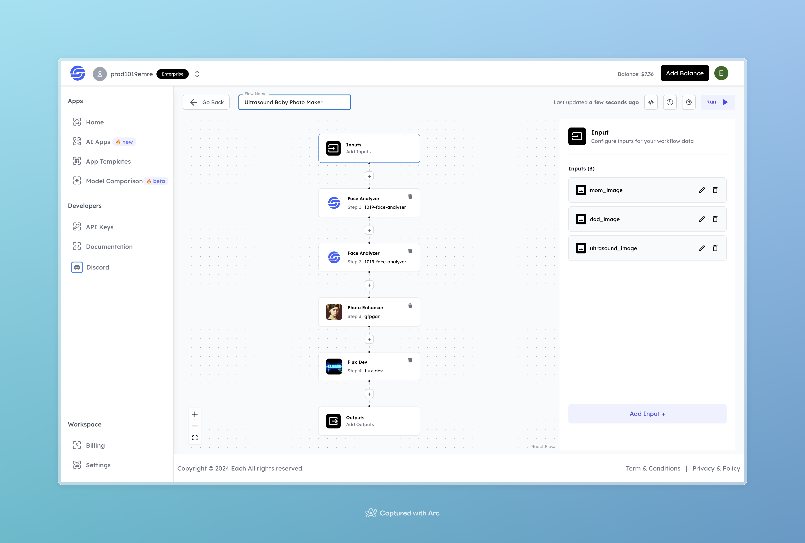

# Ultrasound Baby Photo Maker

## Overview

The **Ultrasound Baby Photo Maker** flow takes images of an expectant mother and father, along with an ultrasound image, to generate an enhanced, lifelike representation of their unborn baby. Using facial analysis and photo enhancement, this flow produces a high-quality visual memento that can be cherished by expectant parents.

## Features

- **Facial Analysis**: Analyzes features of both parents to create a composite for the generated image.
- **Photo Enhancement**: Improves the quality of the ultrasound image for a clearer and more detailed output.
- **Customizable Inputs**: Accepts images of both parents and an ultrasound scan to tailor the output to the specific family.

## Use Cases

- Creating personalized keepsakes for expectant parents.
- Enhancing ultrasound images for a more memorable visual experience.
- Generating a unique photo that combines both parents' features.

## Inputs

### 1. `mom_image`
- **Type**: Image File
- **Title**: Mother's Image
- **Component**: Input field

**Description**: Upload an image of the mother for facial analysis. This will be used in creating the composite image.

### 2. `dad_image`
- **Type**: Image File
- **Title**: Father's Image
- **Component**: Input field

**Description**: Upload an image of the father for facial analysis. This will be combined with the mother's image to form a composite.

### 3. `ultrasound_image`
- **Type**: Image File
- **Title**: Ultrasound Image
- **Component**: Input field

**Description**: Upload the ultrasound image of the baby. This image will be enhanced to create a more detailed output.

## Example

### Input
- **Mother's Image**:

- **Father's Image**:

 

- **Ultrasound Image**:

  

### Output
- **Enhanced Baby Image**:

  

## Conclusion

If you encounter an error, you can join our <b><a href="https://discord.com/invite/yzZD4ZxBPt" target="_blank">Discord</a></b> server.
