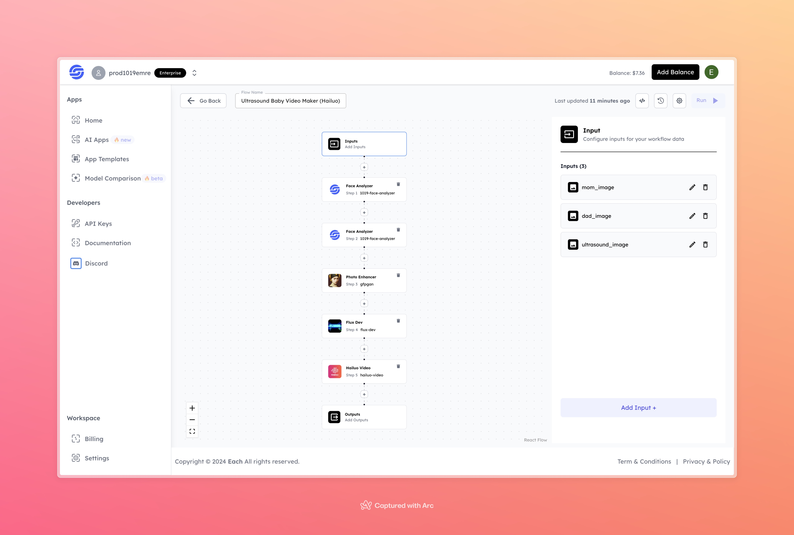

# Ultrasound Baby Video Maker (Hailuo)

## Overview

The **Ultrasound Baby Video Maker (Hailuo)** flow is a unique process that takes images of the mother, father, and an ultrasound scan to generate a video representation of the unborn baby. By analyzing parental features and enhancing ultrasound visuals, this flow creates a special video that can serve as a memorable keepsake for expectant parents.

## Features

- **Face Analysis**: Analyzes the facial features of both parents using the Face Analyzer tool.
- **Image Enhancement**: Enhances the quality of images using a photo enhancer, providing a clearer and more detailed visual.
- **Video Generation**: Combines all processed data to generate a video with the Hailuo Video tool.
- **Customizable Inputs**: Allows uploading of specific images of the parents and ultrasound scan for a personalized video output.

## Inputs

### 1. `mom_image`
- **Type**: Image File
- **Title**: Mother's Image
- **Component**: Input field

**Description**: Upload an image of the mother for facial analysis. This image will contribute to the final video by analyzing her facial features.

### 2. `dad_image`
- **Type**: Image File
- **Title**: Father's Image
- **Component**: Input field

**Description**: Upload an image of the father for facial analysis. This image will be used along with the mother's image to generate a composite representation in the final video.

### 3. `ultrasound_image`
- **Type**: Image File
- **Title**: Ultrasound Image
- **Component**: Input field

**Description**: Upload the ultrasound image of the baby. This image will be enhanced and used as the primary visual component of the video.

## Outputs

### Video Output
The final output is a video that combines both parental features and the enhanced ultrasound image. This video can be saved and shared as a memorable keepsake for the parents-to-be.

## Example

### Input
- **Mother's Image**:

- **Father's Image**:

 

- **Ultrasound Image**:

  

### Output
- **Generated Video**:
  [Click to video](https://storage.googleapis.com/magicpoint/github-outputs/ultrasound-video-maker-hailuo-output.mp4)

## Conclusion

If you encounter an error, you can join our <b><a href="https://discord.com/invite/yzZD4ZxBPt" target="_blank">Discord</a></b> server.
