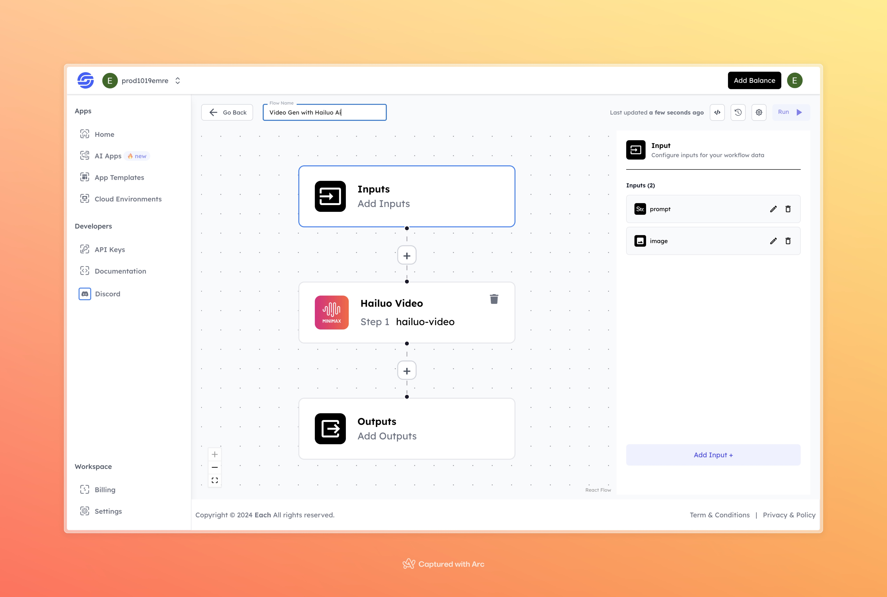

# Video Generation with Hailuo AI

## Overview
This model generates a video based on the input prompt and image using Hailuo AI. It processes the given text and image to produce a custom video output.

## Inputs

### 1. `prompt`
- **Type:** `String`
- **Title:** `Text Prompt`
- **Component:** `Input field`

**Description:** The input text that will guide the video generation. This could be a description or keywords related to the video content.

### 2. `image`
- **Type:** `String`
- **Title:** `Image File`
- **Component:** `File`

**Description:** The input image file used in the video generation process. Supported formats include `.jpg`, `.png`, etc.

## Usage

These inputs are required to run the model successfully. Providing the prompt and an image will ensure that the model generates the expected video.

- **Prompt**: Enter the text or description that will define the video.
- **Image**: Upload the image file that will be used as a base for video creation.

Once these inputs are provided, the model processes the text and image and generates a custom video.

## Example

### Input 1

#### Prompt: 
 a talking woman 

### Input 2

#### Image:

### Output

**Video**:

[Output Video](https://storage.googleapis.com/magicpoint/github-outputs/video-gen-hailuo-github-output.mp4)

## Conclusion

If you encounter an error, you can join our <b><a href="https://discord.com/invite/yzZD4ZxBPt" target="_blank">Discord</a></b> server.
