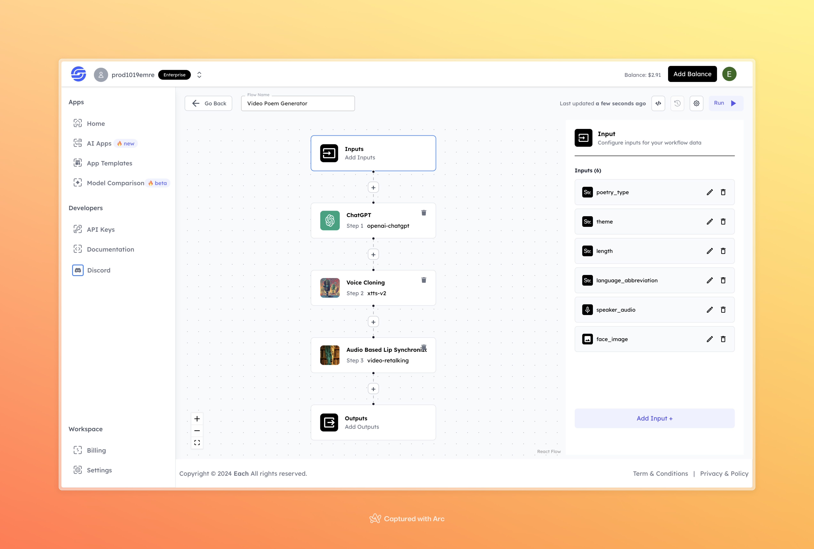

# Video Poem Generator

## Overview
The Video Poem Generator helps you create personalized poetry videos. Simply input the type of poem, theme, and additional details, and the system generates a video with synchronized lip movements and a voice matching the selected speaker.

## Features
- **AI-Generated Poetry**: Create poems based on your selected type and theme.
- **Voice Cloning**: Generate a voice that matches your speaker audio.
- **Lip Synchronization**: Produce videos where the character’s lips match the generated audio.

## Use Cases
- Create heartfelt poetry videos for special occasions.
- Make creative content for social media or personal use.
- Experiment with AI-generated art and voice cloning for fun or professional purposes.

## Inputs

### 1. poetry_type
- **Type:** String 
- **Description:** Defines the type of poetry to generate (e.g., sonnet, haiku).

### 2. theme
- **Type:** String 
- **Description:** The main theme or subject of the poem (e.g., love, nature).

### 3. length
- **Type:** String 
- **Description:** Length of the poem (e.g., short, medium, long).

### 4. language_abbreviation
- **Type:** String 
- **Description:** Language of the poem in abbreviation format (e.g., "en" for English, "fr" for French).

### 5. speaker_audio
- **Type:** Audio File 
- **Description:** Upload a sample audio file of the speaker for voice cloning.

### 6. face_image
- **Type:** Image File 
- **Description:** Upload an image for lip-synchronized video generation.

## Example 

### Input
- **Poetry Type:** romantic  
- **Theme:** Love  
- **Length:** 8 Lines  
- **Language Abbreviation:** en  
- **Speaker Audio:** [Audio](https://storage.googleapis.com/magicpoint/global_inputs/each-audio.mp3)  
- **Face Image:**  

### Output
- **Video Poem:**
[Output Video](https://storage.googleapis.com/magicpoint/github-outputs/video-poem-generator-github-output.mp4)

## Conclusion
If you encounter an error, you can join our <b><a href="https://discord.com/invite/yzZD4ZxBPt" target="_blank">Discord</a></b> server.
