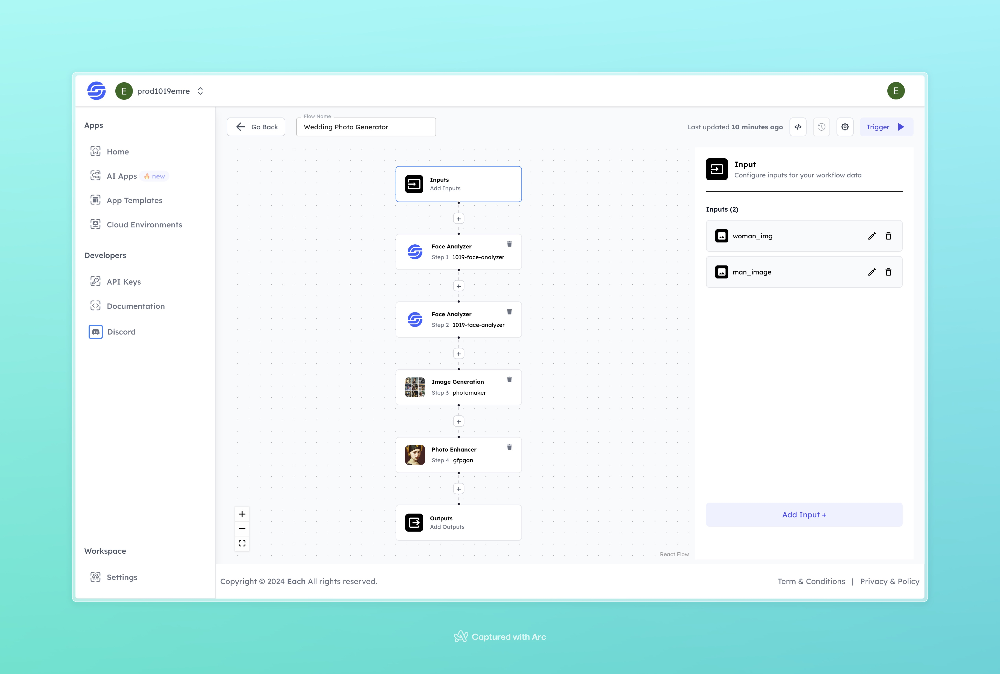

# Wedding AI Image Generation

## Overview
Generate Wedding AI Images using Eachlabs workflows—seamlessly integrate custom wedding visuals into your web and mobile applications with Eachlabs API.

## Features
- **Realistic Wedding Photo Creation**
- **Advanced Face Analysis**
- **High-Quality, Polished Output**

## Use Cases
- Personalized wedding photo creation
- Wedding invitation visuals
- Social media content related to weddings
- Fun, creative projects for couples

## Inputs

### 1. `woman_img`
- **Type:** Image file
- **Title:** Woman’s Image
- **Component:** Input field

**Description:** Upload a clear image of the woman whose face will be used in the generated wedding photo. Supported formats include `.jpg`, `.png`, and other common image types.

### 2. `man_img`
- **Type:** Image file
- **Title:** Man’s Image
- **Component:** Input field

**Description:** Upload a clear image of the man whose face will be used in the generated wedding photo. Supported formats include `.jpg`, `.png`, and other common image types.

## Usage

Simply upload images of both the man and the woman, and the AI will process the inputs to generate a wedding photo. High-quality input images will ensure the best results.

- **Input Images:** Upload images of both individuals, and the system will generate the wedding photo.

## Examples

### Input 1

### Input 2

### Output

## Conclusion

If you encounter an error, you can join our <b><a href="https://discord.com/invite/yzZD4ZxBPt" target="_blank">Discord</a></b> server.