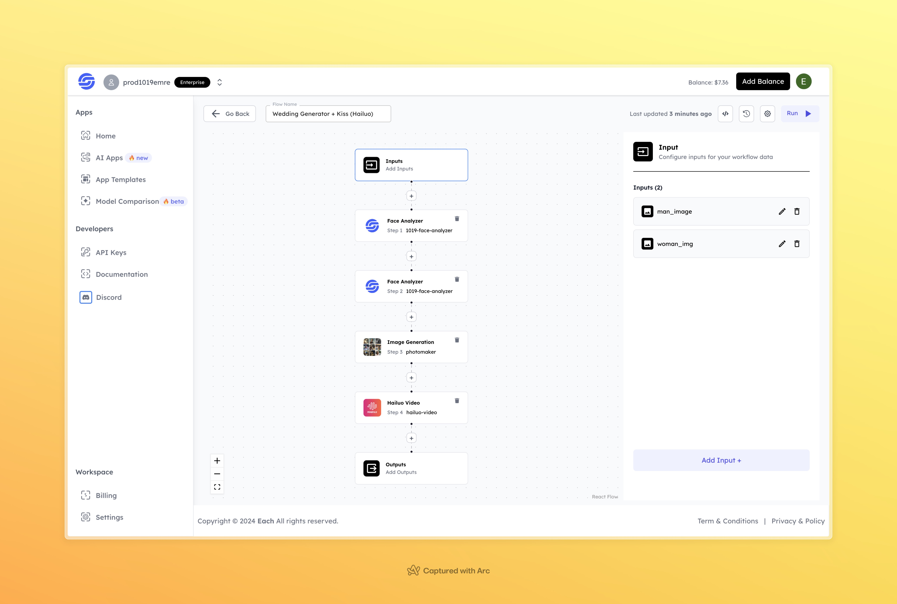

# Wedding Generator + Kiss (Hailuo)

## Overview

The **Wedding Generator + Kiss (Hailuo)** flow takes in images of a man and a woman, analyzes their facial features, and generates a wedding-themed image with a kissing pose. It then processes the image to create a video output that captures the romantic essence of the moment. This flow is ideal for creating wedding-themed visuals and videos from existing images.

## Features

- **Facial Analysis**: Detailed facial recognition and analysis for realistic results.
- **Image Generation**: Creates wedding-themed images based on the facial data.
- **Video Generation**: Converts the generated images into a personalized wedding video with a kissing pose.
- **Customizable Inputs**: Accepts images of a man and woman to personalize the wedding content.

## Use Cases

- Wedding invitations or announcements
- Virtual wedding moments or video creation
- Personalized wedding or couple-themed videos for social media

## Inputs

### 1. `man_image`
- **Type**: Image File
- **Title**: Man’s Image
- **Component**: Input field

**Description**: Upload an image of the man for facial analysis and generation. This image will be used to create the male figure in the wedding video.

### 2. `woman_img`
- **Type**: Image File
- **Title**: Woman’s Image
- **Component**: Input field

**Description**: Upload an image of the woman for facial analysis and generation. This image will be used to create the female figure in the wedding video.

## Example

### Input
- **Man Image**:

 

- **Woman Image**:

### Output
.
[Output Video](https://storage.googleapis.com/magicpoint/github-outputs/wedding-hailuo-kiss-github-output.mp4)

## Conclusion

If you encounter an error, you can join our <b><a href="https://discord.com/invite/yzZD4ZxBPt" target="_blank">Discord</a></b> server.
