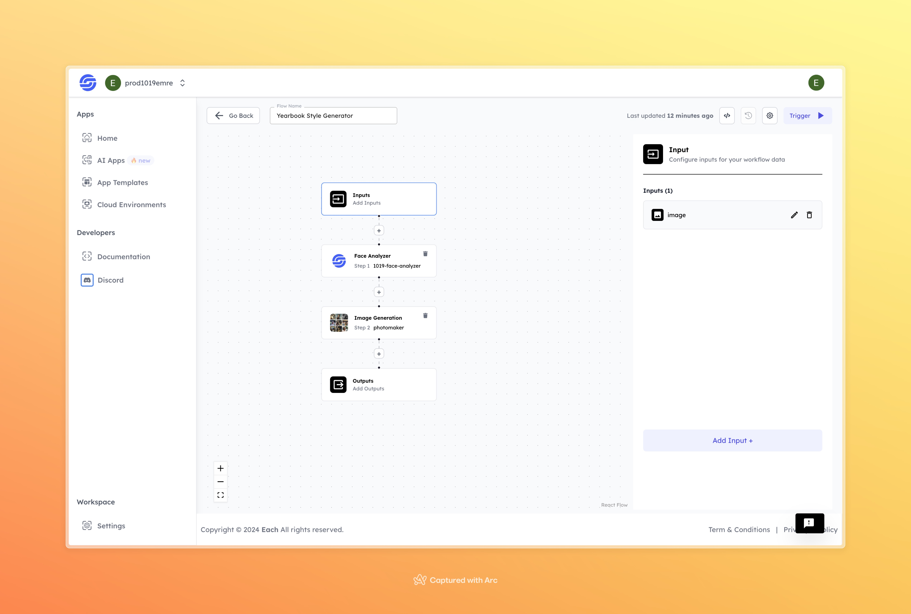

# Yearbook Style Photo Generator

## Overview

The Yearbook Style Generator applies an AI model to transform any photo into a retro yearbook-style portrait. It analyzes facial features and adjusts the image to match the look of classic school photos, including typical elements like lighting, background, and tone. This process is fully automated, requiring only the upload of a photo. The tool generates a high-quality, old-school portrait within seconds, making it easy to recreate the nostalgic yearbook aesthetic without manual design work.

## Features
- **High-Quality Photo Generation**: Produces sharp, realistic images styled as traditional yearbook photos.
- **Facial Feature Analysis**: Identifies and enhances key facial features to ensure natural, true-to-life results.
- **Effortless Workflow**: Simple input steps, quick processing, and beautiful outputs without needing design skills.

## Use Cases
- **School Yearbooks**: Create official student photos for yearbooks quickly and accurately.
- **Alumni Reunions**: Recreate classic yearbook photos for alumni events.
- **Personal Projects**: Design personalized yearbook photos for scrapbooks or digital memories.

## Inputs

### 1. `image`
- **Type:** File (Image)
- **Title:** User Photo
- **Component:** Input field

**Description:** Upload a high-quality image of the person you want to generate a yearbook-style photo for. The AI model will analyze the photo’s facial features and generate a personalized yearbook portrait.

## Usage

To generate a yearbook-style photo, simply upload an image. The model processes the image through facial analysis and creates a realistic, professional yearbook photo. Ensure the image is clear, with the face fully visible for best results.

- **Image Input**: Upload the image you want to use to generate the yearbook-style portrait.

Once the photo is uploaded, the AI will analyze the facial features and apply a yearbook-style effect to create a professional, high-quality image.

## Examples

### Input

### Output

## Conclusion

If you encounter an error, you can join our <b><a href="https://discord.com/invite/yzZD4ZxBPt" target="_blank">Discord</a></b> server.
